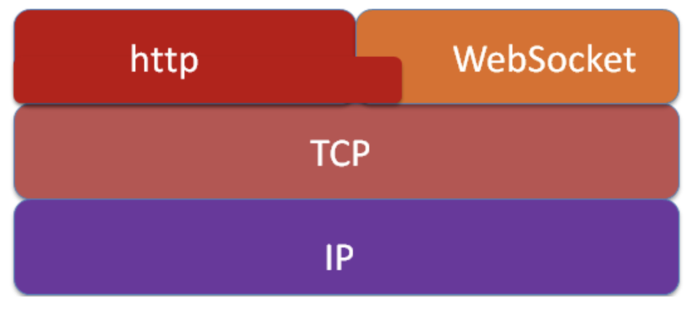
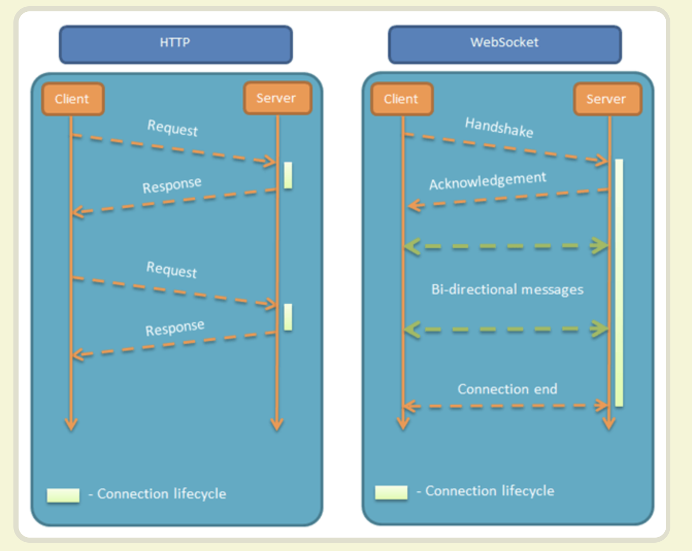
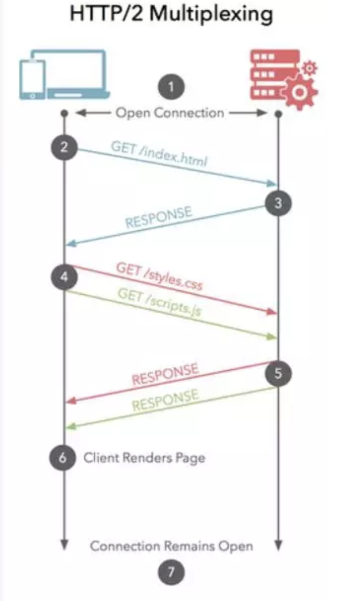
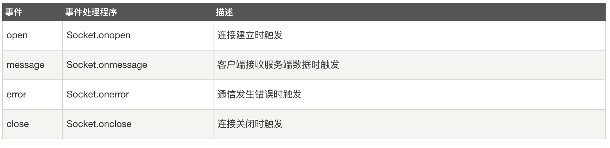
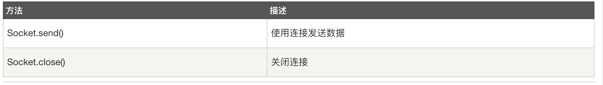
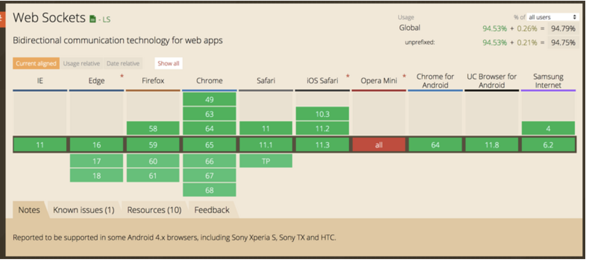

# webSocket


## webSocket解决的问题
在弄清楚webSocket解决了什么样的问题之前，我们需要先了解下网络请求优化的方向:

- 带宽: 现在网络基础建设已经使得带宽得到极大的提升，我们不再会担心由带宽而影响网速
- 延迟: 浏览器阻塞, DNS查询,建立连接
http1.1支持长连接（PersistentConnection）请求的流水线（Pipelining）在一个TCP连接上可以
传送多个HTTP请求和响应，减少了建立和关闭连接的消耗和延迟，在http1.1中默认开启Connection： keep-alive，一定程度上弥补了HTTP1.0每次请求都要创建连接的缺点。

**问题1:**

- Pipelining机制的限制性
- 怎么及时更新服务器的数据

Pipeling解决方式为，若干个请求排队串行化单线程处理，后面的请求等待前面请求的返回
才能获得执行机会，一旦有某请求超时等，后续请求只能被阻塞，毫无办法，也就是人们常说
的线头阻塞；

采用服务端推送机制，及时更新数据




webSocket是HTML5开始提供的一种TCP连接上进行全双工通讯的协议，是真正意义上的持久性连接

**问题2**
- 持久性连接该怎么理解
- multiplexing（多路复用）是什么

无需重复tcp握手阶段，多个http请求无需单独发送header；
多个请求可同时在一个连接上并行执行,某个请求任务耗时严重，不会影响到其它连接的正常执行



## 怎样建立webSocket连接
- 客户端，服务器同时支持
- 认识webSocket连接的区别
- 几个demo实例

```js
		var websocket = new WebSocket("ws://localhost:3000/")
		function showMessage(str){
			var div = document.createElement('div');
			div.innerHTML = str;
			document.body.appendChild(div);
		}
		websocket.onopen = function(){
			console.log('websocket open');
			document.getElementById('sendBtn').onclick = function() {
			var txt = document.getElementById('sendText').value;
			if(txt){
				websocket.send(txt);
			 }	
		  }
		}
		websocket.onclose = function(){
			console.log('websocket close');
		}
		websocket.onmessage = function(e){
			console.log('e.data');
			showMessage(e.data);
			document.getElementById('recv').innerHTML = e.data;
		}
```
```js
var server = ws.createServer(function(conn){
	//用户连接
	console.log("New Connection")
	clientCount++
	conn.nickName = 'user' + clientCount
	broadcast(conn.nickName + "comes in")
	//监听事件
	conn.on("text", function(str){
		console.log("received"+ str)
		broadcast(str)
	})
	conn.on("close",function(code, reason){
		console.log("Connection closed")
		broadcast(conn.nickName + "left")
	})
	conn.on("error",function(err){
		console.log("Handle err")
		console.log(err)
	})
}).listen(PORT)
```







### webSocket协议的特征

- 较少的控制开销。在连接创建后，服务器和客户端之间交换数据时，用于协议控制的数据包头部相对较小。在不包含扩展的情况下，对于服务器到客户端的内容，此头部大小只有2至10字节（和数据包长度有关）；对于客户端到服务器的内容，此头部还需要加上额外的4字节的掩码。相对于HTTP请求每次都要携带完整的头部，此项开销显著减少了。
- 更强的实时性。由于协议是全双工的，所以服务器可以随时主动给客户端下发数据。相对于HTTP请求需要等待客户端发起请求服务端才能响应，延迟明显更少；即使是和Comet等类似的长轮询比较，其也能在短时间内更多次地传递数据。
- 保持连接状态。与HTTP不同的是，Websocket需要先创建连接，这就使得其成为一种有状态的协议，之后通信时可以省略部分状态信息。而HTTP请求可能需要在每个请求都携带状态信息（如身份认证等）。
- 更好的二进制支持。Websocket定义了二进制帧，相对HTTP，可以更轻松地处理二进制内容。
可以支持扩展。Websocket定义了扩展，用户可以扩展协议、实现部分自定义的子协议。如部分浏览器支持压缩等。
- 更好的压缩效果。相对于HTTP压缩，Websocket在适当的扩展支持下，可以沿用之前内容的上下文，在传递类似的数据时，可以显著地提高
压缩率。
- 没有同源限制，客户端可以与任意服务器通信。

## http2.0的对比

- 首先需要了解什么是SPDY
- 多路复用
- Server Push
- 支持二进制格式
- 头部压缩

## socket.io是什么
- [官网链接](https://socket.io/)
- demo实例
Socket.IO 是一个封装了 Websocket、基于Node的JavaScript框架，包含client的JavaScript和server的Node
其不仅支持 WebSocket，还支持许多种轮询机制以及其他实时通信方式，并封装了通用的接口


## 聊天室场景的优化
- 添加消息样式
- 进入，退出样式
- 用户名标志
- socket.io简化

```js
var app = require('http').createServer()
	var  io = require('socket.io')(app)

	io.on('connection', function(socket){
		clientCount++
		socket.nickName = 'user' + clientCount
		io.emit('enter',socket.nickName +'comes in')

		socket.on('message', function(str){
			io.emit('message', socket.nickName +'says:'+ str)
		})
		socket.on('disconnect', function(){
			io.emit('leave' ,socket.nickName +'left')
		})
	})
```

## 总结
本文的目的在于介绍webSocket的原理和使用场景，以一个简易聊天室的案例介绍了websocket的使用和socket.io框架。
理解全文和拓展知识点需要在http协议不同版本的演化基础上，知晓其优点和当前的局限性。从而知道webSocket是在什么
场景下提出的，解决了什么问题，通过提供的demo案例知道如何去实现一个websocket连接，认识常见字段的含义。需要进
一步认识网络请求知识点，见文末拓展链接。
- [demo案例代码]() 
**node wsServer.js** 执行服务端脚本

## 提问环节
- http协议不同版本的特点
- tcp/ip 模型的解释
- 及时获取服务器数据常见方式
- HTTP2.0的多路复用和HTTP1.X中的长连接复用有什么区别？
- webSocket数据帧格式定义
- webSocket解决了什么问题，常见字段含义？


## 拓展链接

- [webSocket原理是什么](https://www.zhihu.com/question/20215561) 
- [HTTP1.0、HTTP1.1 和 HTTP2.0 的区别](https://juejin.im/entry/5981c5df518825359a2b9476) 
- [TCP/IP协议详解](https://juejin.im/post/5a069b6d51882509e5432656) 
- [http协议解读](http://www.alloyteam.com/2016/07/httphttp2-0spdyhttps-reading-this-is-enough/) 
- [WebSocket 通信过程与实现](https://segmentfault.com/a/1190000014643900)
